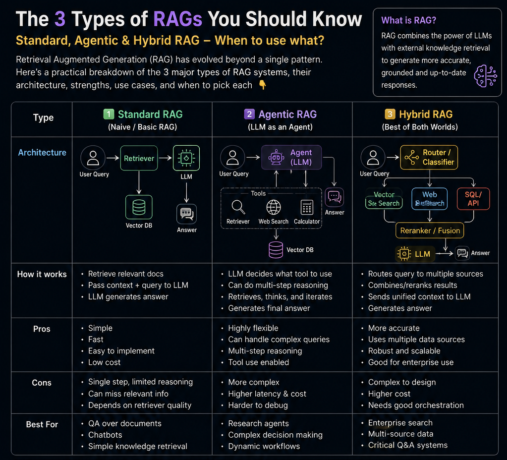

# 🚀 RAG Variants: Standard RAG, Agentic RAG & Hybrid RAG



## Overview

Retrieval-Augmented Generation (RAG) has evolved beyond simple vector search pipelines. In this repository, I implemented and compared three progressively more capable retrieval architectures:

### 1. Standard RAG

A classic Retrieval-Augmented Generation pipeline where relevant chunks are retrieved once from a vector database and passed directly to the LLM.

**Flow**

```text
User Query
    ↓
Vector Search
    ↓
Top-k Chunks
    ↓
LLM
    ↓
Answer
```

**Strengths**

* Simple and easy to implement
* Fast inference
* Low operational cost

**Limitations**

* Single retrieval step
* Limited reasoning capabilities
* May miss distributed information across documents

---

### 2. Agentic RAG

An iterative retrieval system where the LLM plans additional retrieval steps before generating the final response.

**Flow**

```text
User Query
    ↓
Retrieve Context
    ↓
LLM Planning
    ↓
Additional Retrieval
    ↓
Refined Context
    ↓
Final Answer
```

**Strengths**

* Multi-step reasoning
* Better handling of complex questions
* Dynamic query refinement

**Limitations**

* Increased latency
* Higher token usage
* More complex orchestration

---

### 3. Hybrid RAG

Combines semantic retrieval and keyword-based retrieval before merging results into a unified context.

**Flow**

```text
User Query
          ↓
   ┌──────┴──────┐
   ↓             ↓
Vector Search  Keyword Search
   ↓             ↓
   └──────┬──────┘
          ↓
    Retrieval Fusion
          ↓
         LLM
          ↓
       Answer
```

**Strengths**

* Improved recall
* Better retrieval coverage
* More robust than vector search alone

**Limitations**

* Additional retrieval complexity
* Requires fusion strategies

---

## Tech Stack

* PyPDF2
* ChromaDB
* Sentence Transformers (`all-MiniLM-L6-v2`)
* Gemini 2.5 Flash
* LangChain Components

---

## Pipeline

### Document Processing

1. Load PDF documents
2. Extract text using PyPDF2
3. Split text into semantic chunks
4. Generate embeddings
5. Store vectors in ChromaDB

### Retrieval

* Semantic Similarity Search
* Keyword Search
* Retrieval Fusion
* Query Planning (Agentic RAG)

### Generation

* Gemini 2.5 Flash
* Context-aware answering
* Source-grounded responses

---

## Repository Structure

```text
.
├── standard_rag.ipynb
├── agentic_rag.ipynb
├── hybrid_rag.ipynb
├── rag_v.png
└── README.md
```

---

## Example Question

```text
What is attention and how does it improve transformers?
```

### Standard RAG

Retrieves once and answers.

### Agentic RAG

Retrieves, plans, retrieves additional information, then answers.

### Hybrid RAG

Combines vector and keyword retrieval before answering.

---

## Key Takeaway

There is no single "best" RAG architecture.

| Use Case            | Recommended Architecture |
| ------------------- | ------------------------ |
| Simple Document Q&A | Standard RAG             |
| Multi-Hop Reasoning | Agentic RAG              |
| Enterprise Search   | Hybrid RAG               |

Choosing the right retrieval strategy often has a greater impact on answer quality than changing the LLM itself.

---

⭐ If you found this useful, feel free to star the repository and connect with me on LinkedIn.
